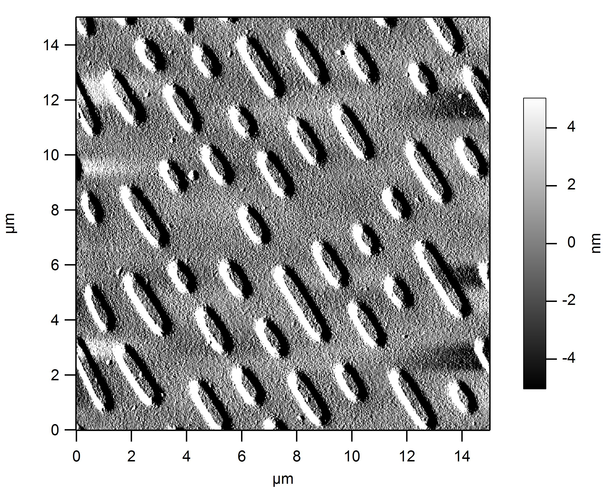

How Compact Discs Work
======================

This document explains the way data is stored on Compact Discs.

We will start by looking at the physical structure of the information-carrying
surface of a CD, where 'pits' and 'lands' are present that contain all of the
information.

From there, we will work our way up to the level where we can understand how
the information can be extracted from those structures: both the main audio
data and so-called 'subchannel' data, that allow the CD player to know the
track it is playing.

We will also explore the measures that have been taken to correct errors in
the readout process.

The surface of a CD
-------------------

The image below (courtesy of Wikimedia Commons user *freiermensch*) shows a
small part of the information-carrying surface of a Compact Disc. The
information on a CD is laid out in a long spiral-like track, which can be up
to 5 kilometers (just over 3 miles) long.

This is reminiscent of the way data is stored on an old vinyl record. There
are several key differences, though.

First, vinyl records are played back using a 'constant angular velocity' of
33, 45, or (for very old records) 78 rotations-per-minute. This means that
the quality of the playback is best when the needle is on the outside of the
record. CD's, on the other hand, are played back at a 'constant radial
velocity' of about 1.4 meters-per-second. This means that a Compact Disc has
to rotate much faster when reading the information close to its center.

Second, CDs are read from the inside to the outside, rather than from the
outside to the inside. This makes it possible to accomodate different sizes
of CDs (e.g., regular CDs with a diameter of 120 mm CDs versus smaller CDs),
without changes to the mechanics.

Third, and by far most important, is that the actual data on a CD is
*digital* rather than *analog*. This means that the actual information
is represented using a small set of readily distinguishable states.

In case of the CD, two distinguishable states are used: the 'lands' and
'pits' that the laser encounters while following a track. The precise height
of the lands and the pits isn't used to carry information; it's just the
fact that there is (or isn't) a pit at a certain place that matters, not how
deep it is. In contrast, in a vinyl record the sides of the track followed
by the needle are 'wavey', and the audio information is contained in the
precise shape of the track waves.

The Compact Disc is quite a feat of engineering, considering that it was
developed in the late 70s and early 80s. At the physical level, a CD player
has to be able to follow a microscopic track of lands and pits that passes
under its laser. This is a challenging control problem; if a CD fails it
is most often due to the inability of the CD player to follow the track
properly, with the consequence that the CD 'skips', and needs to restart a
search for the track.

Furthermore, it is necessary that the laser readout electronics can reliably
distinguish between lands and pits. This is actually the part that requires
a laser rather than a regular light source; the height difference between
the lands and pits is chosen to make sure that the reflected laser signal
exhibits either constructive or destructive interference, which can be
detected by an optical sensor. For this to work, it is necessary to precisely
focus the laser onto the surface of the CD, which is another challenging
control problem.

But let's assume for the moment that these challenges are met, and that the
CD player is able to track the spiral of lands and pits perfectly. The next
section discusses what the laser readout electronic 'sees' at that point.

The laser signal while playing the CD
-------------------------------------

Oscilloscope
Eye pattern

Raw captured data
-----------------

Note that we do not now if the 0's correspond to 'lands' and the 1's to 'pits', or vice versa.
However, the first step of the signal processing is to alter the signal to look at places where the signal changes from
land-to-pit, or from pit-to-land, so this really doesn't make a difference.

Delta signal: only changes matter
---------------------------------

An Compact Disc with all lands in pits, and pits in lands, would play too.

Frame structure
---------------

A frame consists of a SYNC pattern, a single 'sidechannel' byte, 12 bytes of audio data, 4 bytes of error correction data, 12 bytes of audio data, and another 4 bytes of error correction data.

All 33 bytes of data in a single frame are EFM encoded. The SYNC pattern and the 33 bytes (each encoded as 14 bits) are all followed by so-called 'merge' bits.

All this means that a single frame is encoded as 24 + 3 + 33 * (14 + 3) = 588 bits.

Sector structure
----------------

98 frames make up a sector.

Sync patterns

Subchannel information
----------------------

8 channels of information: P, Q, R, S, T, U, V, W

Only P and Q are normally used, the others are zeroes.

The alignment problem.

Audio and audio data error correction
-------------------------------------

References
----------
